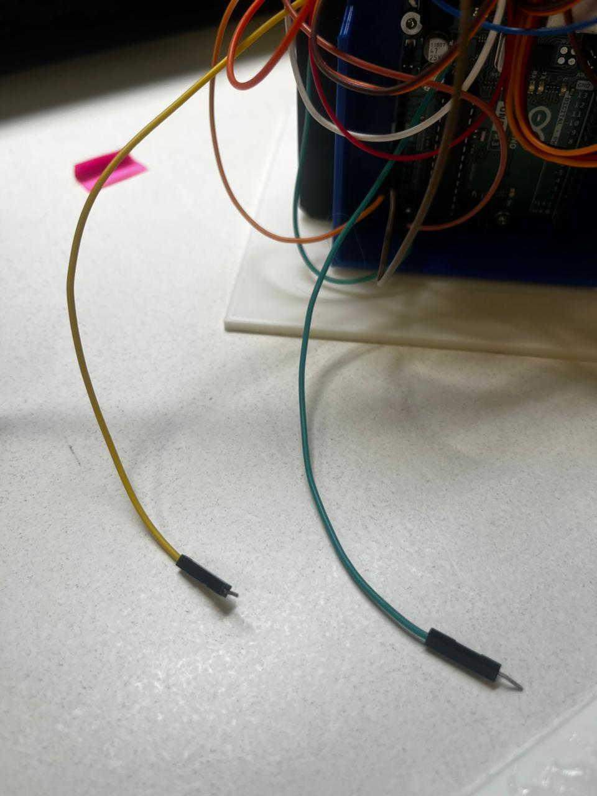
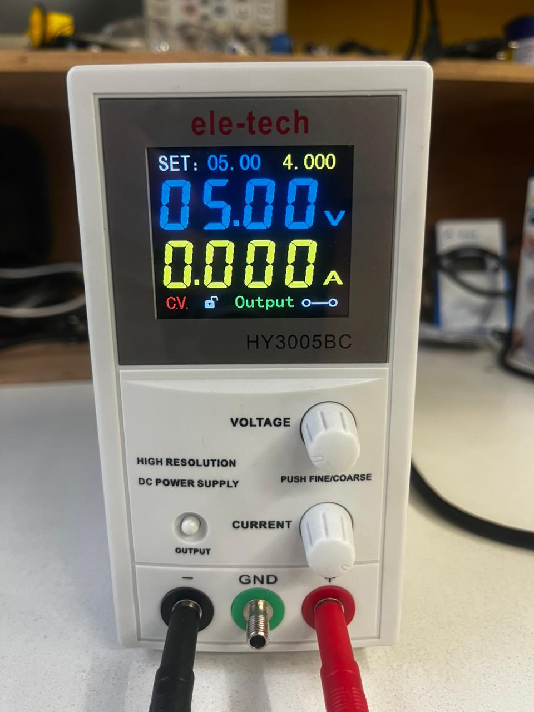
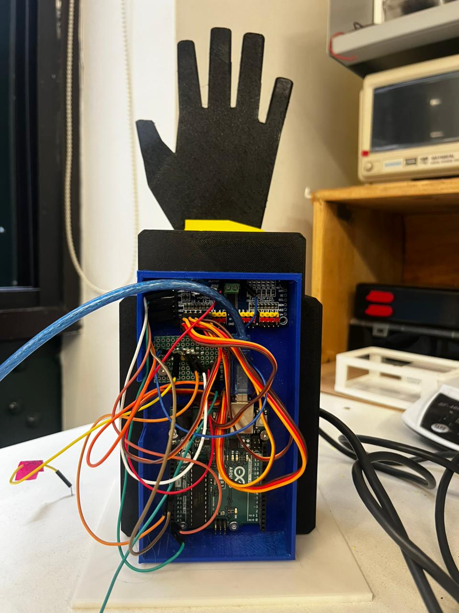
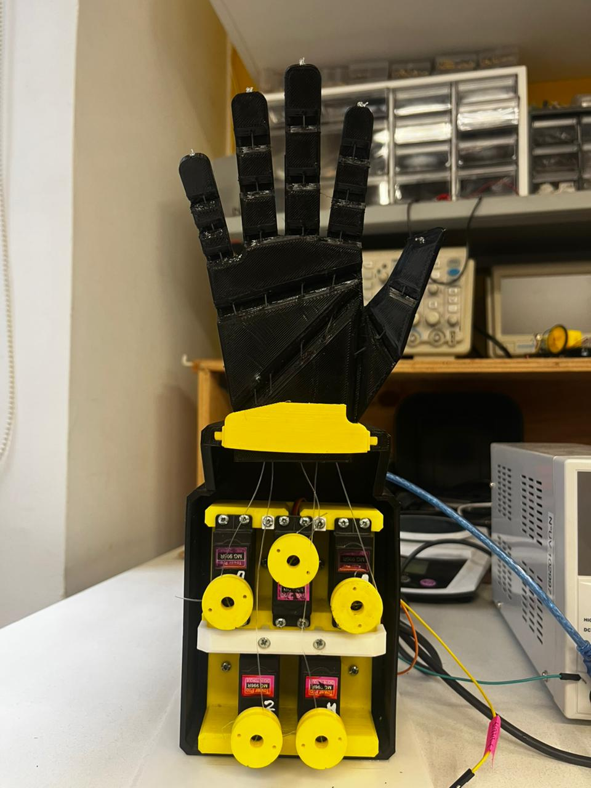

# Control de Mano Robótica con Servos (Cámara + Arduino + Python)

**Estado:** Terminado (Versión 2.0)

Este proyecto permite el control en tiempo real de una mano robótica de 5 dedos mediante visión artificial. El sistema procesa gestos de la mano humana captados por una cámara web y los traduce en movimientos coordinados a través de un controlador PWM.

---

## Descripción General

El sistema opera bajo una arquitectura de comunicación serial dividida en dos etapas:
1.  [cite_start]**Etapa de Visión (Python):** Se utiliza la librería MediaPipe para identificar los puntos clave de la mano y determinar qué dedos se encuentran extendidos en cada fotograma[cite: 1, 2].
2.  [cite_start]**Etapa de Control (Arduino):** El microcontrolador recibe comandos de texto por puerto serie y gestiona una placa PCA9685 para mover los servomotores con una lógica de interpolación suave[cite: 1, 11].

---

## Conexiones de Hardware y Alimentación

### Referencia Visual de Conexiones

*Imagen 1: Identificación de cableado. El cable **verde** se conecta al polo positivo de la fuente y el cable **amarillo** al polo negativo (tierra).*

> [!IMPORTANT]
> [cite_start]**Nota de Alimentación:** Para evitar daños en el microcontrolador y asegurar que los servomotores dispongan del torque necesario, se requiere el uso de una fuente de poder externa ajustada a **5V**. [cite: 7]

*Imagen 2: Configuración de la fuente de poder externa a 5V.*

* **Conexión de la fuente**: Deben conectarse los dos cables libres de la fuente externa: el positivo al pin **V+** y el negativo al pin **GND** de la placa PCA9685.
* **Tierra común**: Es indispensable que el GND de la fuente externa esté compartido con el GND del Arduino para unificar la referencia de la señal.

### Mapeo de Canales (PCA9685)
| Dedo | Canal PCA9685 |
| :--- | :--- |
| **Meñique** | [cite_start]Canal 0 [cite: 5] |
| **Pulgar** | [cite_start]Canal 1 [cite: 5] |
| **Anular** | [cite_start]Canal 2 [cite: 5] |
| **Medio** | [cite_start]Canal 3 [cite: 5] |
| **Índice** | [cite_start]Canal 4 [cite: 5] |

---

## Estructura de la Mano Robótica

Para una correcta referencia del montaje mecánico, se presentan las vistas frontal y posterior del prototipo:

| Vista Frontal | Vista Posterior |
| :---: | :---: |
|  |  |

---

## Funcionamiento del Software

### Detección de Gestos (Python)
El script detecta de forma automática si la mano detectada es la **derecha o la izquierda**, ajustando la lógica de extensión del pulgar según corresponda. El sistema incorpora un **buffer de estabilidad** de 5 frames para impedir movimientos erráticos.

### Control de Movimiento (Arduino)
[cite_start]Se implementa la función `moverServoSuave`, la cual desplaza los servos en incrementos de 5 unidades con un retardo de 5ms[cite: 9, 10, 11]. [cite_start]Esta técnica garantiza un desplazamiento fluido y protege la integridad mecánica[cite: 11].

---

## Instalación y Orden de Ejecución

Para garantizar el funcionamiento correcto del sistema, es necesario seguir estrictamente el siguiente orden:

1.  [cite_start]**Carga del Código Arduino:** Se debe subir el archivo `mano_final_1.ino` a la placa utilizando el IDE de Arduino[cite: 1].
2.  **Preparación del Puerto:** Una vez cargado el programa, se debe verificar que el Monitor Serie del IDE esté **cerrado** para liberar el puerto COM.
3.  **Ejecución del Script Python:** Con el programa de Arduino en ejecución, se debe iniciar el script `python "mano camara final.py"`.
4.  [cite_start]**Verificación de Operación:** El programa de Python enviará comandos en tiempo real, mientras la placa Arduino procesa dichas instrucciones en segundo plano[cite: 12].

---

**Desarrollado por:** Maria-Ignacia Rojas, FabLab UV
**Versión:** v2.0 – Terminado
